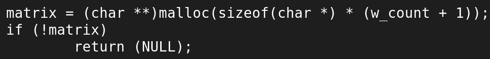
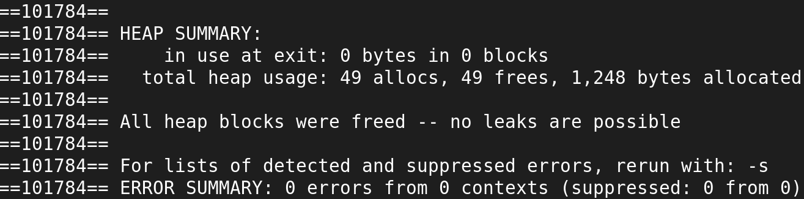

# Useful Commands Cheatsheet 🛠️
A collection of useful command-line snippets for project evaluations, code reviews, and debugging.

## 🚀 How to Use
Copy and paste the commands below. Remember to replace placeholders like `your_file.c` or `./your_program` with your actual file or executable names.

## 🔍 Code Auditing & Searching
Commands for finding specific code, function calls, or potential issues directly from the source.

<table>
<tr>
<td valign="top">
<strong>Find specific words or function calls (e.g., malloc)</strong>

This command recursively (<code>-r</code>) searches all files in the current directory for the string "malloc" and shows the matching line plus the 2 lines After (<code>-A 2</code>) it. This is great for manually checking if all memory allocations were protected correctly.

<pre><code>grep -r -A 2 malloc</code></pre>

<em>Use <code>-B 2</code> for 2 lines Before the match.</em> 
<em>Use <code>-C 2</code> for 2 lines of Context (before and after).</em>

</td>
<td valign="center" width="370" align="center">
<strong>Sample:</strong> 

</td>
</tr>
</table>

## 🧠 Memory & Debugging
Commands for checking memory leaks and runtime errors.

<table>
<tr>
<td valign="top">
<strong>Commands for checking memory leaks and runtime errors.</strong>

 Prerequisite: For best results, always compile your program with the -g flag (debug symbols): 

<pre><code>cc -g main.c static_library.a -o your_program</code></pre>

 <strong> Valgrind</strong> is the gold standard for memory debugging on Linux. It checks for all types of memory issues and provides a full report. 

<pre><code>valgrind --leak-check=full ./your_program</code></pre>

</td>
<td valign="center" width="370" align="center">
<strong>Sample:</strong> 

</td>
</tr>
</table>
